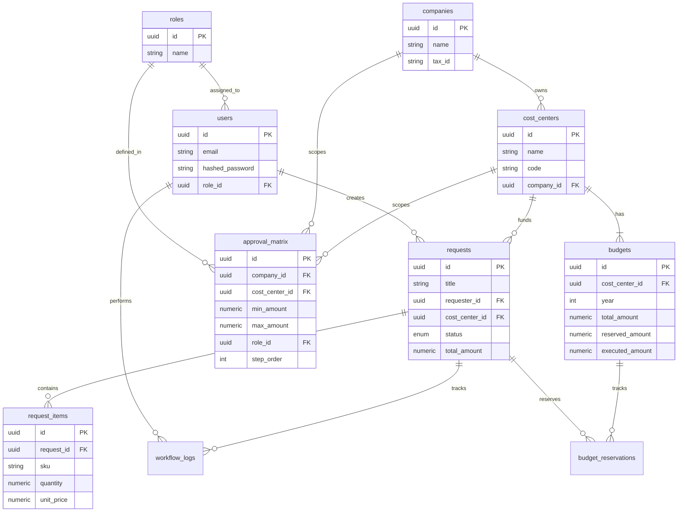

# 04. Database Design

## Schema Overview

The database uses PostgreSQL with UUIDs as primary keys.

### Entity Relationship Diagram (ERD)

## Key Table Definitions

### 1. Users & Auth
- **users**: System users.
- **roles**: Defines permissions (e.g., Administrator, Requester, Approver).

### 2. Organization
- **companies**: Legal entities.
- **cost_centers**: Budget units. linked to a specific company.

### 3. Core Workflow
- **requests**: The header of a purchase request.
- **request_items**: Line items (SKU, Qty, Price).
- **workflow_logs**: Immutable history of actions on a request.
- **approval_matrix**: Configuration table that determines *who* approves *what*.

### 4. Finance
- **budgets**: Yearly budget per Cost Center.
- **budget_reservations**: Link table to lock funds for specific requests.
