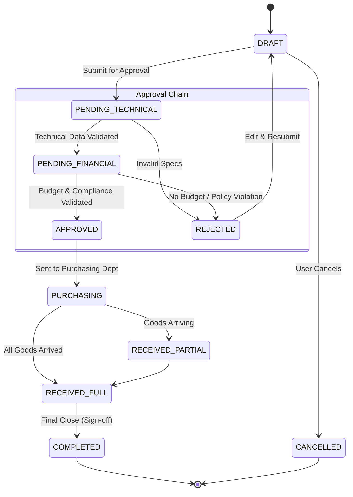

# 05. Workflow Design

## State Machine Definition

The `Request` lifecycle is governed by a strict state machine defined in `RequestStatus`.

### Status Flow Diagram



## Approval Matrix Logic

The logic to move from `PENDING_TECHNICAL` to `PENDING_FINANCIAL` (or other potential intermediate steps) is data-driven.

**Pseudo-code for determining next approver:**
```python
def get_next_approvers(request):
    return query(ApprovalMatrix).filter(
        (ApprovalMatrix.company_id == request.cost_center.company_id) | (ApprovalMatrix.company_id == None),
        (ApprovalMatrix.cost_center_id == request.cost_center_id) | (ApprovalMatrix.cost_center_id == None),
        ApprovalMatrix.min_amount <= request.total_amount,
        (ApprovalMatrix.max_amount >= request.total_amount) | (ApprovalMatrix.max_amount == None)
    ).order_by(ApprovalMatrix.step_order).all()
```

This ensures that:
1.  Global rules (Company=Null) apply unless specific overrides exist.
2.  Amount thresholds trigger different seniority levels (e.g., > $10k needs VP approval).
