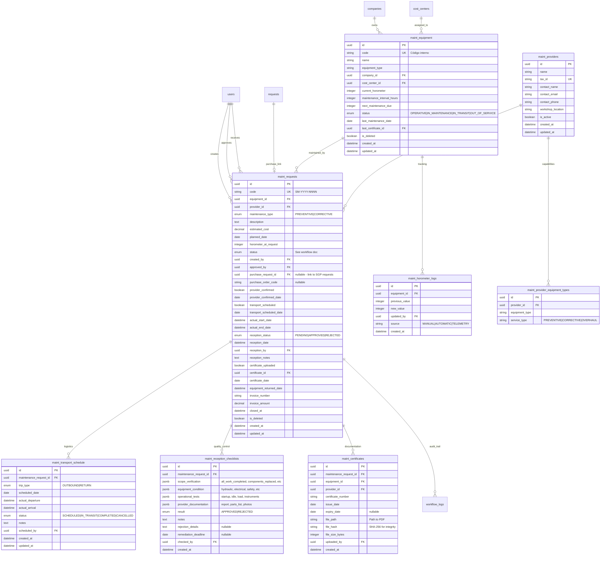

# 13. Módulo de Mantención — Modelo de Datos

> **Versión:** 1.0  
> **Fecha:** Febrero 2026  
> **Dependencia:** `04_DATABASE_DESIGN.md`, `12_MAINT_REQUERIMIENTOS_FUNCIONALES.md`  

---

## 1. Principio de Extensión

El módulo de mantención se agrega como **extensión** del esquema existente. No modifica tablas core del SGP. La integración se logra mediante:

- Nuevas tablas con prefijo `maint_` para evitar colisiones.
- FKs hacia tablas existentes (`companies`, `cost_centers`, `requests`, `users`, `roles`).
- Reutilización de `workflow_logs` con `entity_type = 'maintenance_request'`.
- Migración Alembic incremental (`alembic revision --autogenerate -m "add_maintenance_module"`).

---

## 2. ERD — Módulo de Mantención



---

## 3. Definición de Tablas (DDL referencial)

### 3.1 maint_equipment

```sql
CREATE TABLE maint_equipment (
    id UUID PRIMARY KEY DEFAULT gen_random_uuid(),
    code VARCHAR(50) UNIQUE NOT NULL,
    name VARCHAR(200) NOT NULL,
    equipment_type VARCHAR(100) NOT NULL,
    company_id UUID NOT NULL REFERENCES companies(id),
    cost_center_id UUID NOT NULL REFERENCES cost_centers(id),
    current_horometer INTEGER NOT NULL DEFAULT 0,
    maintenance_interval_hours INTEGER NOT NULL,
    next_maintenance_due INTEGER NOT NULL,
    status VARCHAR(20) NOT NULL DEFAULT 'OPERATIVE'
        CHECK (status IN ('OPERATIVE', 'IN_MAINTENANCE', 'IN_TRANSIT', 'OUT_OF_SERVICE')),
    last_maintenance_date DATE,
    last_certificate_id UUID,
    is_deleted BOOLEAN NOT NULL DEFAULT FALSE,
    created_at TIMESTAMPTZ NOT NULL DEFAULT NOW(),
    updated_at TIMESTAMPTZ NOT NULL DEFAULT NOW()
);

CREATE INDEX idx_maint_equipment_status ON maint_equipment(status) WHERE NOT is_deleted;
CREATE INDEX idx_maint_equipment_company ON maint_equipment(company_id) WHERE NOT is_deleted;
CREATE INDEX idx_maint_equipment_horometer ON maint_equipment(current_horometer, next_maintenance_due) WHERE NOT is_deleted;
```

### 3.2 maint_requests

```sql
CREATE TABLE maint_requests (
    id UUID PRIMARY KEY DEFAULT gen_random_uuid(),
    code VARCHAR(20) UNIQUE NOT NULL,
    equipment_id UUID NOT NULL REFERENCES maint_equipment(id),
    provider_id UUID NOT NULL REFERENCES maint_providers(id),
    maintenance_type VARCHAR(20) NOT NULL DEFAULT 'PREVENTIVE'
        CHECK (maintenance_type IN ('PREVENTIVE', 'CORRECTIVE')),
    description TEXT,
    estimated_cost NUMERIC(12, 2) NOT NULL,
    planned_date DATE NOT NULL,
    horometer_at_request INTEGER NOT NULL,
    status VARCHAR(30) NOT NULL DEFAULT 'DRAFT',
    created_by UUID NOT NULL REFERENCES users(id),
    approved_by UUID REFERENCES users(id),
    
    -- Vinculación con SGP
    purchase_request_id UUID REFERENCES requests(id),
    purchase_order_code VARCHAR(20),
    
    -- Flujos paralelos
    provider_confirmed BOOLEAN NOT NULL DEFAULT FALSE,
    provider_confirmed_date DATE,
    transport_scheduled BOOLEAN NOT NULL DEFAULT FALSE,
    transport_scheduled_date DATE,
    
    -- Ejecución
    actual_start_date TIMESTAMPTZ,
    actual_end_date TIMESTAMPTZ,
    
    -- Recepción conforme
    reception_status VARCHAR(20) DEFAULT 'PENDING'
        CHECK (reception_status IN ('PENDING', 'APPROVED', 'REJECTED')),
    reception_date TIMESTAMPTZ,
    reception_by UUID REFERENCES users(id),
    reception_notes TEXT,
    
    -- Certificado
    certificate_uploaded BOOLEAN NOT NULL DEFAULT FALSE,
    certificate_id UUID,
    certificate_date DATE,
    
    -- Retorno y cierre
    equipment_returned_date TIMESTAMPTZ,
    invoice_number VARCHAR(50),
    invoice_amount NUMERIC(12, 2),
    closed_at TIMESTAMPTZ,
    
    is_deleted BOOLEAN NOT NULL DEFAULT FALSE,
    created_at TIMESTAMPTZ NOT NULL DEFAULT NOW(),
    updated_at TIMESTAMPTZ NOT NULL DEFAULT NOW()
);

CREATE INDEX idx_maint_requests_status ON maint_requests(status) WHERE NOT is_deleted;
CREATE INDEX idx_maint_requests_equipment ON maint_requests(equipment_id) WHERE NOT is_deleted;
CREATE INDEX idx_maint_requests_planned ON maint_requests(planned_date) WHERE NOT is_deleted;
CREATE INDEX idx_maint_requests_purchase ON maint_requests(purchase_request_id) WHERE purchase_request_id IS NOT NULL;
```

### 3.3 maint_reception_checklists

```sql
CREATE TABLE maint_reception_checklists (
    id UUID PRIMARY KEY DEFAULT gen_random_uuid(),
    maintenance_request_id UUID NOT NULL REFERENCES maint_requests(id),
    scope_verification JSONB NOT NULL DEFAULT '{}',
    equipment_condition JSONB NOT NULL DEFAULT '{}',
    operational_tests JSONB NOT NULL DEFAULT '{}',
    provider_documentation JSONB NOT NULL DEFAULT '{}',
    result VARCHAR(20) NOT NULL CHECK (result IN ('APPROVED', 'REJECTED')),
    notes TEXT,
    rejection_details TEXT,
    remediation_deadline DATE,
    checked_by UUID NOT NULL REFERENCES users(id),
    created_at TIMESTAMPTZ NOT NULL DEFAULT NOW()
);

CREATE INDEX idx_maint_checklists_request ON maint_reception_checklists(maintenance_request_id);
```

---

## 4. Integración con Tablas Existentes

### 4.1 workflow_logs (sin modificar estructura)

Se reutiliza la tabla `workflow_logs` existente. Para diferenciar logs de mantención:

```sql
-- Los logs de mantención se identifican por referencia a maint_requests
-- Opción A: agregar campo nullable entity_type
ALTER TABLE workflow_logs ADD COLUMN entity_type VARCHAR(30) DEFAULT 'purchase_request';
ALTER TABLE workflow_logs ADD COLUMN entity_id UUID; -- referencia genérica

-- Opción B: usar el campo request_id existente como FK a maint_requests
-- (requiere hacer request_id nullable y agregar maint_request_id)
ALTER TABLE workflow_logs ADD COLUMN maint_request_id UUID REFERENCES maint_requests(id);
```

**Recomendación:** Opción B es más limpia a nivel de integridad referencial.

### 4.2 requests (tabla existente — sin modificar)

La vinculación es unidireccional: `maint_requests.purchase_request_id → requests.id`. No se modifica la tabla `requests`.

Opcionalmente, se puede agregar un campo en `requests` para identificar solicitudes originadas por mantención:

```sql
ALTER TABLE requests ADD COLUMN source_type VARCHAR(30) DEFAULT 'manual';
-- Valores: 'manual' (creada por usuario), 'maintenance' (generada por SM)
ALTER TABLE requests ADD COLUMN source_reference_id UUID;
-- Referencia a maint_requests.id cuando source_type = 'maintenance'
```

### 4.3 roles (tabla existente — agregar registros)

```sql
INSERT INTO roles (id, name) VALUES
    (gen_random_uuid(), 'Maintenance Planner'),
    (gen_random_uuid(), 'Maintenance Chief');
```

---

## 5. Secuencia de Código Correlativo

```sql
CREATE SEQUENCE maint_request_seq START 1;

-- Función para generar código SM-YYYY-NNNN
CREATE OR REPLACE FUNCTION generate_sm_code() RETURNS VARCHAR AS $$
BEGIN
    RETURN 'SM-' || EXTRACT(YEAR FROM NOW())::TEXT || '-' || 
           LPAD(nextval('maint_request_seq')::TEXT, 4, '0');
END;
$$ LANGUAGE plpgsql;
```

---

## 6. Seed Data Inicial

```sql
-- Proveedores de ejemplo
INSERT INTO maint_providers (id, name, tax_id, contact_name, contact_email, workshop_location, is_active)
VALUES
    (gen_random_uuid(), 'Servicios Mecánicos Norte', '76.xxx.xxx-x', 'Juan Pérez', 'jperez@smn.cl', 'María Elena', true),
    (gen_random_uuid(), 'Mantenciones Industriales SpA', '77.xxx.xxx-x', 'María López', 'mlopez@mi.cl', 'María Elena', true);

-- Equipos de ejemplo
INSERT INTO maint_equipment (id, code, name, equipment_type, company_id, cost_center_id, current_horometer, maintenance_interval_hours, next_maintenance_due)
VALUES
    (gen_random_uuid(), 'EXC-001', 'Excavadora CAT 320', 'Excavadora', '{company_id}', '{cc_id}', 4800, 500, 5000),
    (gen_random_uuid(), 'CAM-001', 'Camión Tolva Volvo FH', 'Camión', '{company_id}', '{cc_id}', 9200, 1000, 10000);
```
