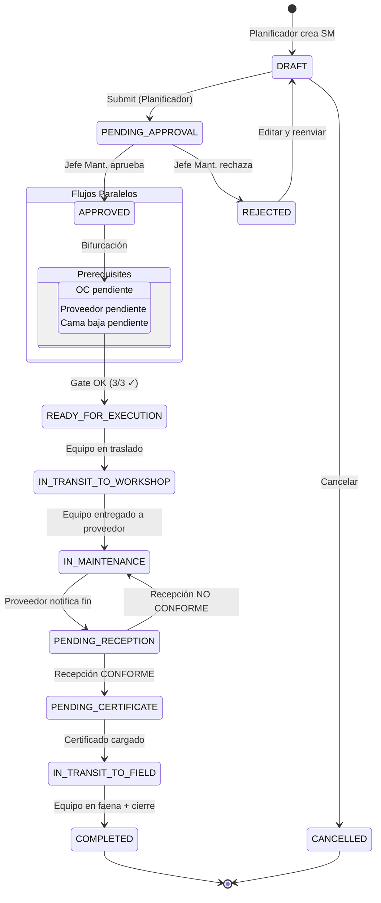

# 14. Módulo de Mantención — Diseño de Workflow

> **Versión:** 1.0  
> **Fecha:** Febrero 2026  
> **Dependencia:** `05_WORKFLOW_DESIGN.md`, `11_MAINT_PROCESO_TOBE.md`  

---

## 1. Máquina de Estados — MaintenanceRequestStatus



---

## 2. Definición de Estados

| Estado | Código | Descripción | Siguiente(s) |
|--------|--------|-------------|---------------|
| **Borrador** | `DRAFT` | SM creada, editable. Planificador completando datos. | `PENDING_APPROVAL`, `CANCELLED` |
| **Pendiente Aprobación** | `PENDING_APPROVAL` | SM enviada, esperando aprobación del Jefe de Mantenimiento. | `APPROVED`, `REJECTED` |
| **Aprobada** | `APPROVED` | SM aprobada. Se disparan 3 flujos paralelos automáticamente. Transición inmediata a `AWAITING_PREREQUISITES`. | `AWAITING_PREREQUISITES` |
| **Esperando Prerrequisitos** | `AWAITING_PREREQUISITES` | En espera de: OC generada, proveedor confirmado, cama baja programada. | `READY_FOR_EXECUTION` |
| **Lista para Ejecución** | `READY_FOR_EXECUTION` | Gate de control aprobado (3/3 condiciones cumplidas). Equipo puede salir de faena. | `IN_TRANSIT_TO_WORKSHOP` |
| **En Tránsito a Taller** | `IN_TRANSIT_TO_WORKSHOP` | Equipo en camión cama baja hacia taller María Elena. | `IN_MAINTENANCE` |
| **En Mantención** | `IN_MAINTENANCE` | Proveedor ejecutando mantención en taller. | `PENDING_RECEPTION` |
| **Pendiente Recepción** | `PENDING_RECEPTION` | Mantención terminada, esperando recepción conforme del Jefe de Mantenimiento. | `PENDING_CERTIFICATE`, `IN_MAINTENANCE` (si rechazada) |
| **Pendiente Certificado** | `PENDING_CERTIFICATE` | Recepción conforme aprobada. Esperando que proveedor emita y cargue certificado. | `IN_TRANSIT_TO_FIELD` |
| **En Tránsito a Faena** | `IN_TRANSIT_TO_FIELD` | Equipo con certificado, en traslado de vuelta a faena. | `COMPLETED` |
| **Completada** | `COMPLETED` | Ciclo cerrado. Equipo en faena con certificado vigente. Terminal. | — |
| **Rechazada** | `REJECTED` | SM rechazada por Jefe de Mantenimiento. Puede editarse y reenviarse. | `DRAFT` |
| **Cancelada** | `CANCELLED` | SM cancelada. Terminal. | — |

---

## 3. Transiciones y Reglas

### 3.1 Tabla de Transiciones

| Transición | Rol Requerido | Precondiciones | Acciones Automáticas |
|-----------|--------------|----------------|---------------------|
| `DRAFT → PENDING_APPROVAL` | `maintenance_planner` | Campos obligatorios completos (equipo, proveedor, costo, fecha). | Notificación a Jefe de Mantenimiento. |
| `PENDING_APPROVAL → APPROVED` | `maintenance_chief` | SM en bandeja de aprobación. | 1. Crear solicitud de compra en SGP (auto). 2. Enviar requerimiento a proveedor. 3. Reservar presupuesto. 4. Transición inmediata a `AWAITING_PREREQUISITES`. |
| `PENDING_APPROVAL → REJECTED` | `maintenance_chief` | Comentario obligatorio. | Notificación a Planificador con motivo. |
| `AWAITING_PREREQUISITES → READY_FOR_EXECUTION` | Sistema (automático) | `provider_confirmed == true` AND `purchase_order_code IS NOT NULL` AND `transport_scheduled == true` | Notificación a Jefe de Mantenimiento: "Gate OK". |
| `READY_FOR_EXECUTION → IN_TRANSIT_TO_WORKSHOP` | `maintenance_chief` | Gate aprobado. | Cambiar equipo a status `IN_TRANSIT`. Registrar timestamp de salida. |
| `IN_TRANSIT_TO_WORKSHOP → IN_MAINTENANCE` | `maintenance_chief` | Acta de entrega firmada (opcional digital). | Cambiar equipo a status `IN_MAINTENANCE`. |
| `IN_MAINTENANCE → PENDING_RECEPTION` | `maintenance_chief` | Proveedor notifica finalización. | Notificación urgente a Jefe Mant: "Recepción pendiente". |
| `PENDING_RECEPTION → PENDING_CERTIFICATE` | `maintenance_chief` | Checklist de recepción completo con resultado `APPROVED`. | Notificación a proveedor: "Emitir certificado". |
| `PENDING_RECEPTION → IN_MAINTENANCE` | `maintenance_chief` | Checklist con resultado `REJECTED` + observaciones. | Notificación a proveedor con observaciones y plazo. |
| `PENDING_CERTIFICATE → IN_TRANSIT_TO_FIELD` | `maintenance_chief` | Archivo de certificado cargado y verificado. | Cambiar equipo a `IN_TRANSIT`. |
| `IN_TRANSIT_TO_FIELD → COMPLETED` | `maintenance_chief` | Equipo confirmado en faena. | Cambiar equipo a `OPERATIVE`. Actualizar `last_maintenance_date`, `last_certificate_id`. Calcular `next_maintenance_due`. |

### 3.2 Gate de Control — Detalle

```python
def check_prerequisites(maintenance_request: MaintRequest) -> dict:
    """
    Verifica las 3 condiciones obligatorias para habilitar ejecución.
    Retorna estado de cada condición y si el gate está aprobado.
    """
    conditions = {
        "purchase_order": {
            "met": maintenance_request.purchase_order_code is not None,
            "description": "Orden de Compra generada y confirmada",
            "responsible": "Abastecimiento",
        },
        "provider_confirmed": {
            "met": maintenance_request.provider_confirmed == True,
            "description": "Proveedor confirmó disponibilidad",
            "responsible": "Proveedor / Jefe de Mantenimiento",
        },
        "transport_scheduled": {
            "met": maintenance_request.transport_scheduled == True,
            "description": "Cama baja programada",
            "responsible": "Jefe de Mantenimiento",
        },
    }
    
    gate_approved = all(c["met"] for c in conditions.values())
    
    return {
        "gate_approved": gate_approved,
        "conditions": conditions,
        "missing": [k for k, v in conditions.items() if not v["met"]],
    }
```

### 3.3 Auto-transición AWAITING_PREREQUISITES → READY_FOR_EXECUTION

La transición de `AWAITING_PREREQUISITES` a `READY_FOR_EXECUTION` es **automática**. Se evalúa cada vez que se actualiza una de las 3 condiciones:

```python
async def on_prerequisite_updated(maintenance_request_id: UUID, db: AsyncSession):
    """
    Se ejecuta cuando: 
    - Se registra confirmación de proveedor
    - Se vincula OC (desde flujo SGP)
    - Se programa cama baja
    """
    mr = await get_maintenance_request(maintenance_request_id, db)
    
    if mr.status != "AWAITING_PREREQUISITES":
        return
    
    gate = check_prerequisites(mr)
    
    if gate["gate_approved"]:
        mr.status = "READY_FOR_EXECUTION"
        await log_workflow_action(
            entity_type="maintenance_request",
            entity_id=mr.id,
            action="GATE_APPROVED",
            from_status="AWAITING_PREREQUISITES",
            to_status="READY_FOR_EXECUTION",
            performed_by="SYSTEM",
            details=gate,
        )
        await notify(mr.created_by, "Gate de control aprobado - equipo listo para salir")
```

---

## 4. Vinculación con Workflow SGP Existente

### 4.1 Flujo Integrado

```
MANTENCIÓN                           SGP (existente)
─────────                           ───────────────
SM creada (DRAFT)                    
SM enviada (PENDING_APPROVAL)        
SM aprobada (APPROVED) ──────────→  Request creada (DRAFT → PENDING_TECHNICAL)
                                     ↓
AWAITING_PREREQUISITES               Request aprobada (APPROVED)
  ← OC vinculada ───────────────←  Purchasing genera OC
                                     
READY_FOR_EXECUTION                  
IN_TRANSIT_TO_WORKSHOP               
IN_MAINTENANCE                       
PENDING_RECEPTION                    
PENDING_CERTIFICATE                  
IN_TRANSIT_TO_FIELD                  
COMPLETED ───────────────────────→  Request → RECEIVED_FULL → COMPLETED
```

### 4.2 Webhook / Event para vincular OC

Cuando abastecimiento genera la OC en el flujo estándar del SGP, se debe propagar la información a la SM:

```python
async def on_purchase_order_created(request_id: UUID, po_code: str, db: AsyncSession):
    """
    Hook que se ejecuta cuando se genera OC en el SGP.
    Si la solicitud está vinculada a una SM, actualiza la SM.
    """
    # Buscar si hay SM vinculada a esta solicitud
    result = await db.execute(
        select(MaintRequest).where(
            MaintRequest.purchase_request_id == request_id
        )
    )
    mr = result.scalar_one_or_none()
    
    if mr and mr.status == "AWAITING_PREREQUISITES":
        mr.purchase_order_code = po_code
        await on_prerequisite_updated(mr.id, db)
```

---

## 5. Actualización Automática de Equipo

El status del equipo se actualiza automáticamente según las transiciones de la SM:

| Transición SM | Status Equipo |
|--------------|---------------|
| `READY → IN_TRANSIT_TO_WORKSHOP` | `OPERATIVE → IN_TRANSIT` |
| `IN_TRANSIT_TO_WORKSHOP → IN_MAINTENANCE` | `IN_TRANSIT → IN_MAINTENANCE` |
| `PENDING_CERTIFICATE → IN_TRANSIT_TO_FIELD` | `IN_MAINTENANCE → IN_TRANSIT` |
| `IN_TRANSIT_TO_FIELD → COMPLETED` | `IN_TRANSIT → OPERATIVE` |

Además, al completar:
- `equipment.current_horometer` se puede actualizar si se registró horómetro al egreso.
- `equipment.last_maintenance_date = maint_request.actual_end_date`
- `equipment.last_certificate_id = maint_request.certificate_id`
- `equipment.next_maintenance_due = equipment.current_horometer + equipment.maintenance_interval_hours`

---

## 6. SLA Engine

```python
# Configuración de SLAs (parametrizable)
MAINTENANCE_SLAS = {
    "PENDING_APPROVAL": {
        "max_hours": 16,  # 2 días hábiles
        "escalation_to": "operations_manager",
        "warning_at_hours": 8,
    },
    "AWAITING_PREREQUISITES.purchase_order": {
        "max_hours": 24,  # 3 días hábiles  
        "escalation_to": "procurement_chief",
        "warning_at_hours": 16,
    },
    "AWAITING_PREREQUISITES.provider_confirmed": {
        "max_hours": 24,  # 3 días hábiles
        "escalation_to": "maintenance_chief",
        "warning_at_hours": 16,
    },
    "PENDING_RECEPTION": {
        "max_hours": 8,  # 1 día hábil
        "escalation_to": "maintenance_chief",
        "warning_at_hours": 4,
    },
    "PENDING_CERTIFICATE": {
        "max_hours": 16,  # 2 días hábiles
        "escalation_to": "maintenance_chief",
        "warning_at_hours": 8,
    },
}
```

---

## 7. Audit Trail — Acciones del Módulo

| Acción | Registra |
|--------|----------|
| `SM_CREATED` | Planificador crea SM |
| `SM_SUBMITTED` | SM enviada a aprobación |
| `SM_APPROVED` | Jefe Mant. aprueba |
| `SM_REJECTED` | Jefe Mant. rechaza + motivo |
| `PURCHASE_REQUEST_GENERATED` | Sistema crea solicitud de compra automáticamente |
| `PROVIDER_CONFIRMED` | Proveedor confirma disponibilidad |
| `TRANSPORT_SCHEDULED` | Cama baja programada |
| `GATE_APPROVED` | 3/3 condiciones cumplidas |
| `GATE_BLOCKED` | Condiciones faltantes detalladas |
| `EXECUTION_STARTED` | Equipo entregado a proveedor |
| `EXECUTION_COMPLETED` | Proveedor notifica fin |
| `RECEPTION_APPROVED` | Recepción conforme con checklist |
| `RECEPTION_REJECTED` | Recepción rechazada con observaciones |
| `CERTIFICATE_UPLOADED` | Certificado cargado en sistema |
| `EQUIPMENT_RETURNED` | Equipo de vuelta en faena |
| `SM_CLOSED` | Cierre formal del ciclo |
| `SM_CANCELLED` | SM cancelada |
| `SLA_WARNING` | SLA próximo a vencer |
| `SLA_BREACHED` | SLA excedido → escalamiento |
